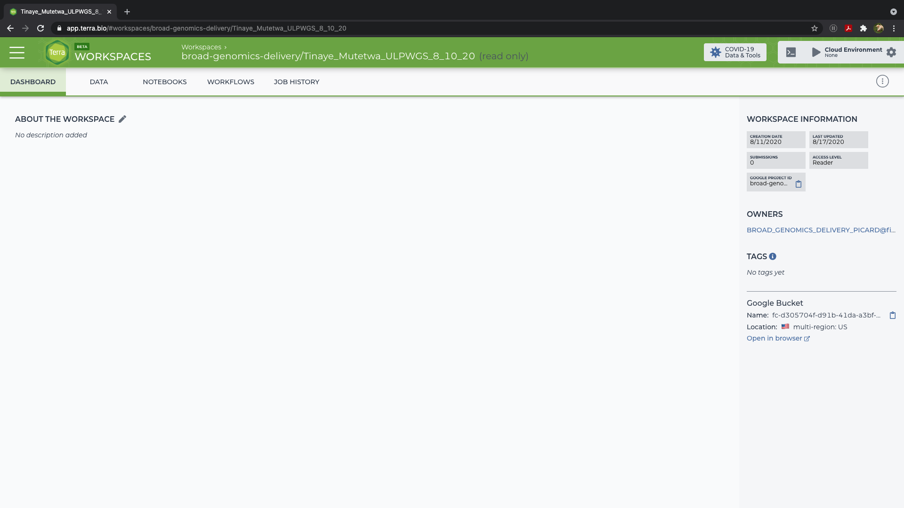
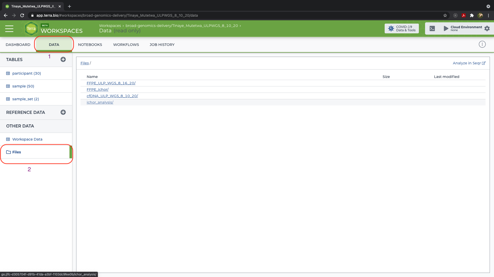
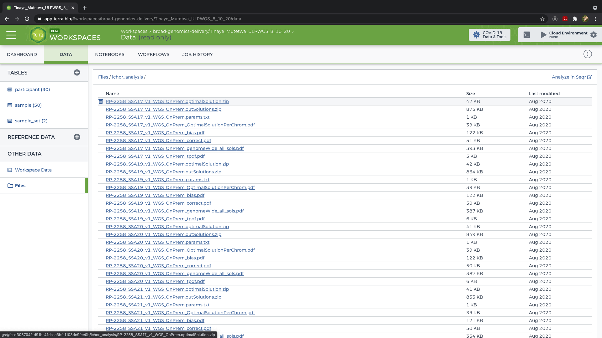
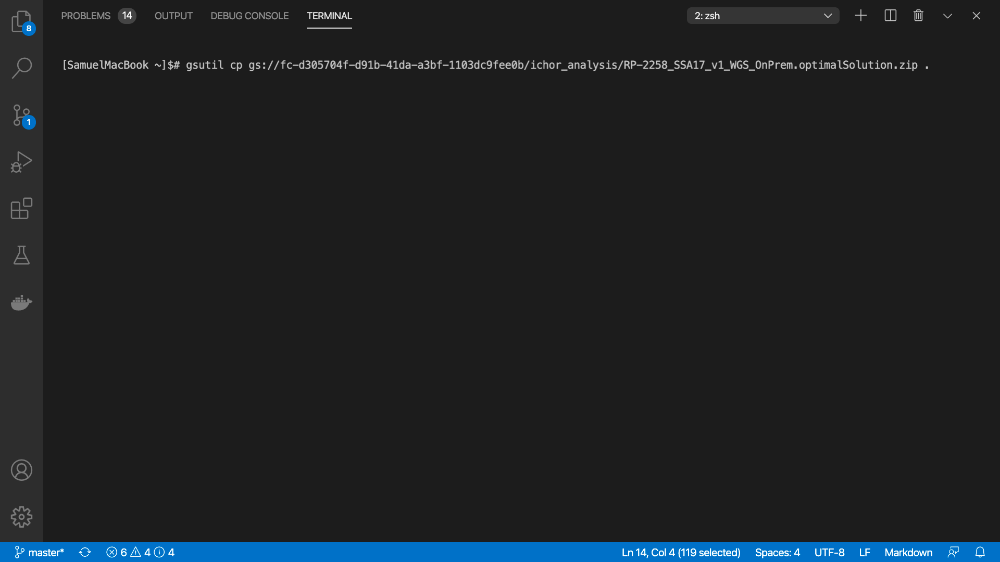

# creating comut plots from ichorCNA results

* Go to the terra workspace where your ichor results are saved;
	ie. https://app.terra.bio/#workspaces/broad-genomics-delivery/Tinaye_Mutetwa_ULPWGS_8_10_20
    
* click on `data` on the top left, then `files` on bottom left

* Navigate the folders to get your ichorCNA results

* open terminal and use `gsutil` to download the optimal solutions (in zipped files) in ichorCNA results folder
[//]: # For example use this to download single file

`$ gsutil cp gs://fc-d305704f-d91b-41da-a3bf-1103dc9fee0b/ichor_analysis/RP-2258_SSA17_v1_WGS_OnPrem.optimalSolution.zip .`

[//]: # or use this (add wild cards) to download multiple files

`$ gsutil cp gs://fc-d305704f-d91b-41da-a3bf-1103dc9fee0b/ichor_analysis/*.optimalSolution.zip .`
